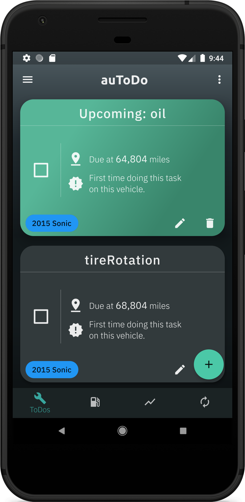
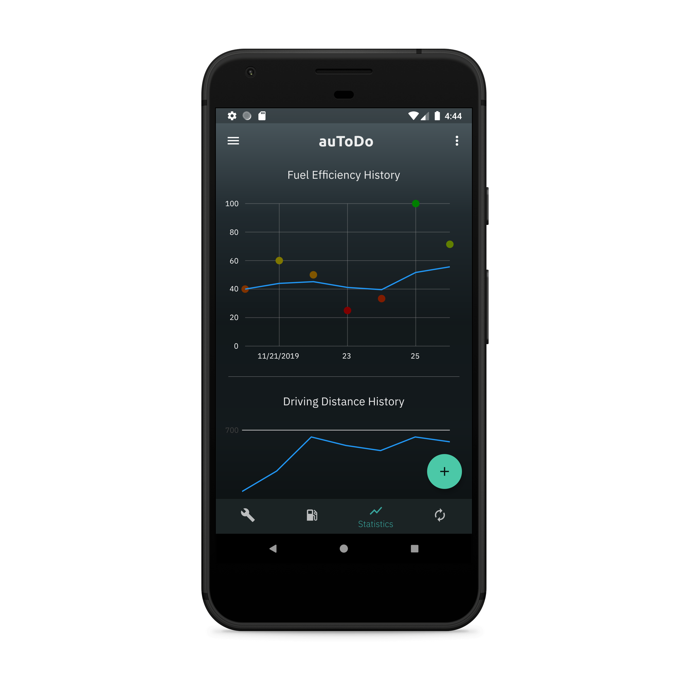
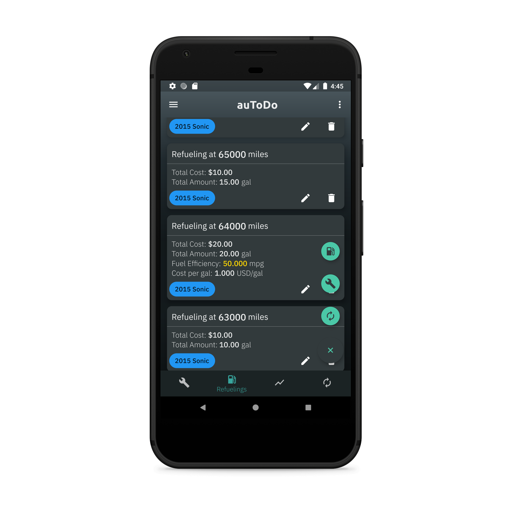

# auToDo

    

A flexible, intuitive ToDo list app for keeping track of your cars' maintenance needs.

Currently in alpha development for [Android](https://github.com/baylessj/autodo/projects/1) and support for iOS is [coming soon](https://github.com/baylessj/autodo/projects/3).

## Overview

</img>    </img>     </img>

Create recurring maintenance tasks that will remind you to keep your vehicle in top shape and track your car's fuel usage and expenses. Maintenance task reminders can be on a time based interval, such as switching from all-season to winter tires each year, or the reminders can be based on your car's mileage. You don't even have to log every refueling to get timely maintenance reminders for mileage based intervals -- auToDo will learn the typical rate of driving for your car based on the refuelings that you do log so that reminders are on time.

## License 

auToDo is licensed under the [Apache License Version 2.0](https://www.apache.org/licenses/LICENSE-2.0.txt) with the notable addition of the [Commons Clause](https://commonsclause.com/).

You are welcome to use this project locally, modify it, redistribute it, and contribute to it per the typical Apache License terms, but with the stipulation that you do not sell this software in binary or source form. 

## Contributing

New issues and pull requests are welcome and encouraged! Please see the [CONTRIBUTING](./CONTRIBUTING.md) file in this repository for more information on contributing.
